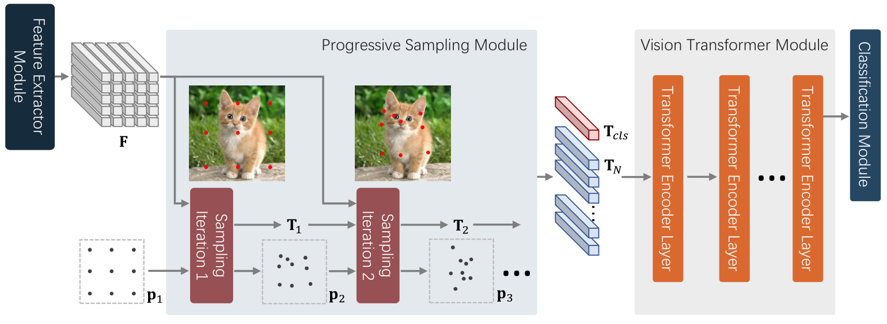

# Vision Transformer with Progressive Sampling

This is the official implementation of the paper [Vision Transformer with Progressive Sampling](https://arxiv.org/abs/2108.01684), ICCV 2021.





## Installation Instructions
- Clone this repo:

```bash
git clone git@github.com:yuexy/PS-ViT.git
cd PS-ViT
```

- Create a conda virtual environment and activate it:

```bash
conda create -n ps_vit python=3.7 -y
conda activate ps_vit
```

- Install `CUDA==10.1` with `cudnn7` following
  the [official installation instructions](https://docs.nvidia.com/cuda/cuda-installation-guide-linux/index.html)
- Install `PyTorch==1.7.1` and `torchvision==0.8.2` with `CUDA==10.1`:

```bash
conda install pytorch==1.7.1 torchvision==0.8.2 cudatoolkit=10.1 -c pytorch
```

- Install `timm==0.3.4, einops, pyyaml`:

```bash
pip3 install timm=0.3.4, einops, pyyaml
```

- Install `Apex`:

```bash
git clone https://github.com/NVIDIA/apex
cd apex
pip install -v --disable-pip-version-check --no-cache-dir --global-option="--cpp_ext" --global-option="--cuda_ext" ./
```

- Install `PS-ViT`:

```bash
python setup.py build_ext --inplace
```


## Results and Models
*All models listed below are evaluated with input size 224x224*

| Model      | Top1 Acc | #params | FLOPS |   Download  |
| :---       |  :---:   |  :---:  | :---: |    :---:    | 
| PS-ViT-Ti/14 |  75.6    |  4.8M  | 1.6G | Coming Soon |
| PS-ViT-B/10 |  80.6    |  21.3M  | 3.1G | Coming Soon |
| PS-ViT-B/14 |  81.7    |  21.3M  | 5.4G | [Google Drive](https://drive.google.com/file/d/1FAAOCbpgPKlSe3dWIzQLg8JK6okvZkC5/view?usp=sharing) |
| PS-ViT-B/18 |  82.3    |  21.3M  | 8.8G | [Google Drive](https://drive.google.com/file/d/1KG4TdrfbNNdbNImCPCdSeQ5Y-gkDMlnr/view?usp=sharing) |

## Evaluation

To evaluate a pre-trained `PS-ViT` on ImageNet val, run:

```bash
python3 main.py <data-root> --model <model-name> -b <batch-size> --eval_checkpoint <path-to-checkpoint>
```

## Training from scratch

To train a `PS-ViT` on ImageNet from scratch, run:

```bash
bash ./scripts/train_distributed.sh <job-name> <config-path> <num-gpus>
```

## Citing PS-ViT
```
@article{psvit,
  title={Vision Transformer with Progressive Sampling},
  author={Yue, Xiaoyu and Sun, Shuyang and Kuang, Zhanghui and Wei, Meng and Torr, Philip and Zhang, Wayne and Lin, Dahua},
  journal={Proceedings of the IEEE/CVF International Conference on Computer Vision (ICCV)},
  year={2021}
}
```

## Contact
If you have any questions, don't hesitate to contact Xiaoyu Yue.
You can easily reach him by sending an email to yuexiaoyu002@gmail.com.
